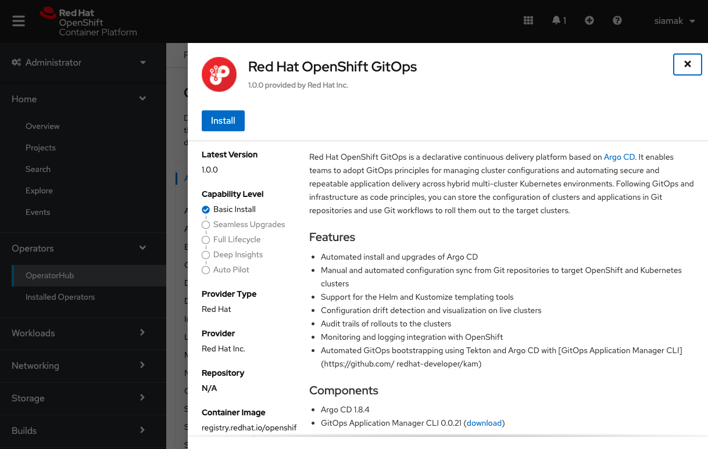
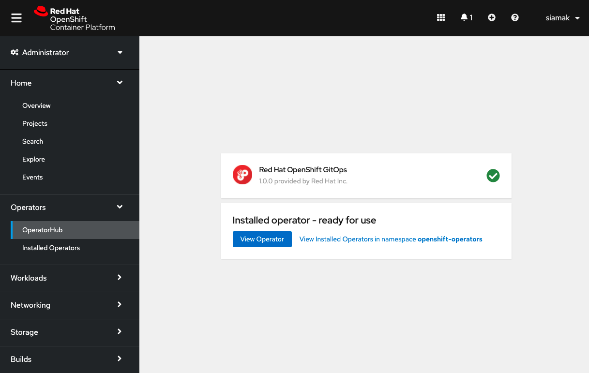
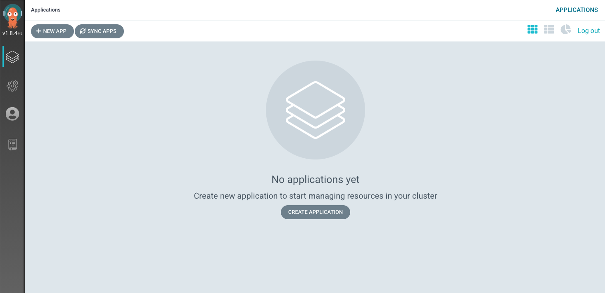

# Getting Started with OpenShift GitOps

## Install OpenShift GitOps 

Log into OpenShift Web Console as a cluster admin and navigate to the **Administrator** perspective and then **Operators** &rarr; **OperatorHub**. 

In the **OperatorHub**, search for *OpenShift GitOps* and follow the operator install flow to install it.






Once OpenShift GitOps is installed, an instance of [Argo CD](https://argo-cd.readthedocs.io/en/stable/) is automatically installed on the cluster in the `openshift-gitops` namespace and link to this instance is added to the application launcher in OpenShift Web Console.


## Accessing Argo CD

Argo CD upon installation generates an initial admin password which is stored in a Kubernetes secret. In order to retrieve this password, run the following command to decrypt the admin password:

```
kubectl get secret argocd-cluster-cluster -n openshift-gitops -ojsonpath='{.data.admin\.password}' | base64 -d
```

Click on Argo CD from the OpenShift Web Console application launcher and then log into Argo CD with `admin` username and the password retrieved from the previous step.





## Configure OpenShift with GitOps

